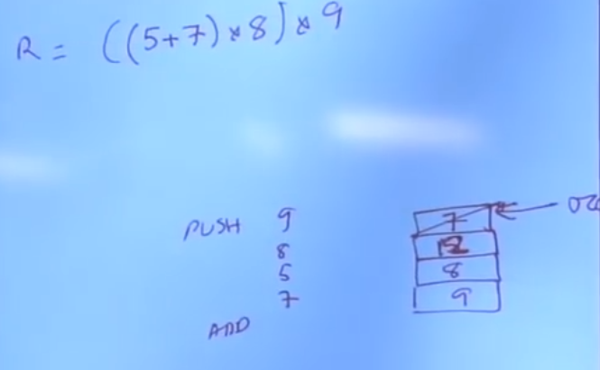
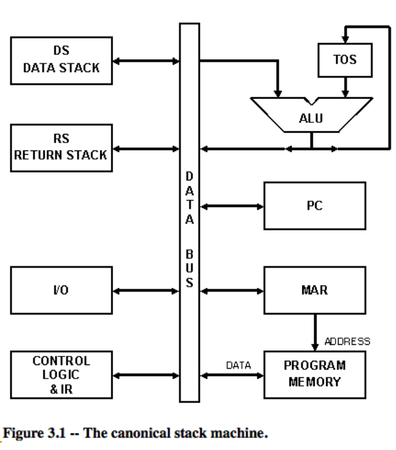
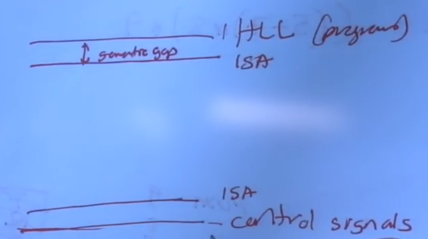
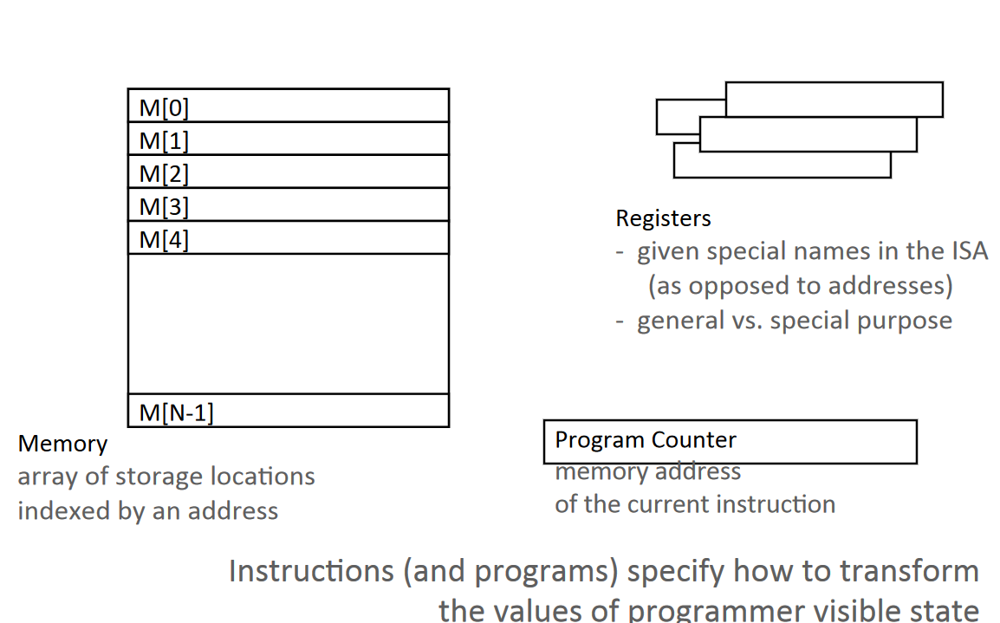
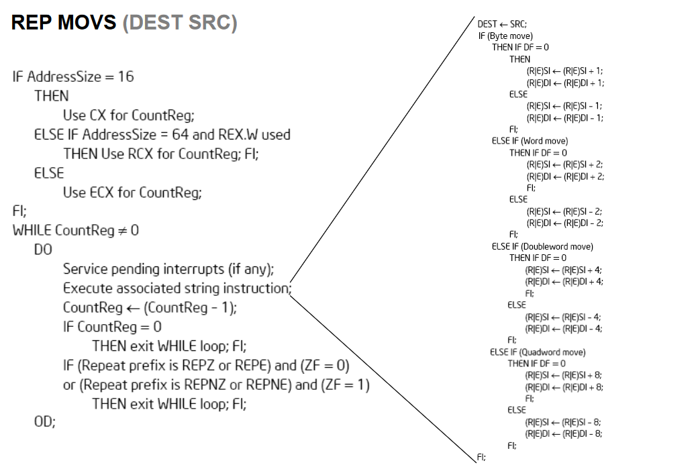
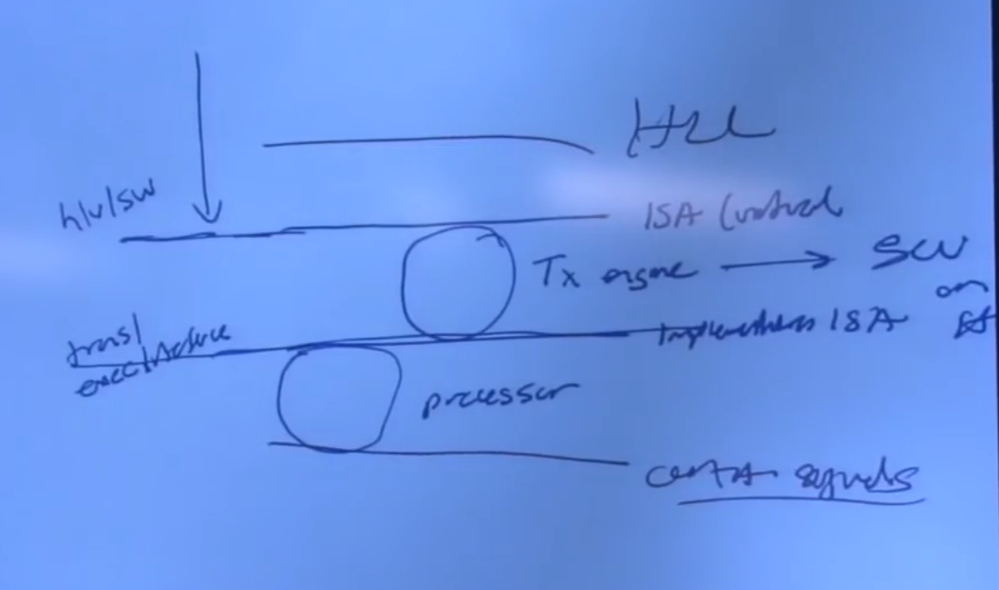

ISA architectures and its tradeoffs
- ISA:
    - agreed upon interface btw software and hardware
    - mciroatchitecture: specific implementation of an ISA
    - micorproessor: ISA, uarch, circuits 
- Microarchitecture: 
    - it is a **specific** implementation of the ISA under specific design constraints and goals
    - these design points can be (determines how you implement the ISA):
        - cost, performance, max power consumption, energy consumption, availability, time to market
    - things done in hardwdare without exposure to software:
        - pipelining
        - in-order VS out-of-order instruction execution
        - memory access scheduling policy
        - speculative execution
        - superscalar processing
        - clock gating
        - caching? Levels, size, associativity, replacement policy
        - prefetching?
        - votlage/frequency scaling

- ISA-level tradeoffs
- Microarchitecture level tradeoffs
- systme and task level tradeoffs

- Many different ISAs over decades
    - x76, PDP-x, VAX, CDC6600, RISC ISAs: Alpha, MIPS, SPARC,ARM

- Fundamental differences:
    - how instructions are specified and what they do
    - how complex are the instructions

- Intructions:
    - opcode: what the isntruction does
    - operands: who it is to do it to
- Set of instructions, encoding and spec
    - you may have unused instructions in order for future applications that need more instructions
    - Bit steering: change you how you interpret remaining bits, "steers" the hardware how to interpret certain bits 
    - Example:
        - 2 instructions:
            - ADD DR, SR1, SR2
            - ADD DR, SR1, imm5
            - 0001 DR SR1 0 00 SR2
            - 0001 DR SR1 1 --imm5-
        - Operation:
            - if (bit[5] == 0){
                DR = SR1 + SR 2;
            }
            else{
                DR = SR1 + SEXT(imm5)
            }
            setcc;
        - decoding is a bit more complex, depends on that steering bit
- Elements of an ISA:
    - Instruction sequencing model
        - control flow vs data flow
    - Instruction processing style:
        - specifies the number of "operands" and instruction "operates" on and how it does so
        - 0,1,2,3,address machines
            - 0-address: stack machine (OP, PUSH A, POP A), location is always implicit
            - 1-address: accumulator machine (OP ACC, LD A, ST A)
            - 2-address: 2-operand machine (OP S,D; one is both source and dest)
            - 3-address: 3-operand machine (OP S1,S2,D, source and dest seperate)
- Stack Machine:
    - small instruction size (no operands needed for operate instructions)
        - simpler logic, compact code
    - efficient procedure calls: all parameters on stack
        - no additional cycles for parameter passing
    - computations that are not easily expressible with 'postfix notation' are difficult to map to stack machines
        - cannot perform operations on many values at the same time
        - not flexible

- Stack Machine Operation
    -  

- Elements of an ISA:
    - Instructions:
        - Opcode
        - Operand specifiers (addressing modes)
            - How to obtain the operand?
    - Data types:
        - Definition: representation of information for which there are instructions that operate on the representation
    - Integer,floating points,character,binary,decimal, BCD

- what is the benefit of having more or high level data types in the ISA:
- Concept of semantic gap?
    - how close are the instructions to the constructs in the program
    - 
    - early RISC: only integer data type

- Memory organization:
    - address space: how many uniquely identifiable locations in memory
    - addressability: how much data does each uniquely identifiable location store
        - byte addressable: most ISAs, character are 8 bits
        - bit addressable: burroughs 1700, 
        - 64 bit addressable: some supercomputers. why?
        - 32 bit addressable: first alpha
        - food for thought:
            - how do you add 2 32-bit numbers with only byte addressability
            - how do you add 2 8 bit numbers with only 32 bit addressability
            - big endian or small endian? MSB at low or high byte
    
- Elements of an ISA?
    - Registers
        - How many?
        - size of each register?
    - why do we need registers?
        - programs exhibit a characteristic called data locality
        - a recently produced / accessed value is likley to be used more than once
        - storing that value in a register eliminates the need to go to memory each time that value is needed

- Programmer Visible Architectural State

- Programmer Invisible State
    - microarchitectural state
    - programmer cannot access this directly
    - cache states
    - pipeline registers

- Evolution of register architecture
    - accumulator: a legacy from the adding machine days
    - accumulator + address registers
        - need register indirection
        - initiallyh address registers were special purpose 

- Instruction classes
    - operate instructions: 
        - process data: arithmetic and logical operations
        - fetch operations, compute results, store results
        - implicit sequential control flow
    - data movement instructions: 
        - move data betweem memory, registers, I/O devices
        - implicit sequential control flow
    - control flow instructions:
        - change the sequence of instructions that are executed

- Tradeoff btw Load/Store VS Memory/Memory Architectures
    - Load / Store architecture: operate instructions operate only on registers
    - Memory/ memory architecture: operate instructions can operate on memory locations

- Addressing modes: it means how you interpret the address or how do you obtain the operands
    - absolute: LW rt, 10000
    - register indirect: LW rt, (r_base)
    - displaced or based: LW rt, offset(r_base)
    - indexed: use GPR[r_base] + GPR[r_index] as address: LW rt, (r_base,r_index)
    - memory indirect: use value at M[GPR[r_base]] as address
    - auto inc/decrement: LW Rt,(r_base): use GRP[r_base] as address, but inc or dec GPR[r_base] each time

- Advantage of having more addressing modes:
    - enables better mapping of high-level constructs to the machine: some accesses are better expressed with a different mode 
    - this may help reduce number of instructions and code size
- Disadvantage
    - more work for the compiler
    - more work for the microarchitect

- Addressing modes for JSR
    - you can address with PC relative offsetting or with a register

- How to interact with I/O devices
    - memory mapped I/O
        - a region of memory is mapped to I/O devices
        - I/O operations are loads and stores to those locations
    - special I/O isntructions
        - IN / OUT instructions

- Priviledge modes
    - user vs supervisor
    - who can execute what instructions

- exception and interrupt handling
    - what procedure is followed when something goes wrong with an instruction?
    - what procedure is followed when an external device requests the processor?
    - vectored vs non vectored interrupts?

- virtual memory
    - each program has the illusion of the entire memory space, which is greater than physical memory

- Tradeoff btw Complex vs Simple instructions
    - complex instruction: an instruction that does a lot of work
        - (+) denser encoding -> smaller code size -> better memory utilization, saves off-chip bandwidth, better cache hit rate
        - (+) simpler compiler: no need to opimize small instructions as much
        - (-) larger chunks of work -> compiler has less oppurtunity to optimize (limited in fine grained optimizations it can do)
        - (-) more complex hardware -> translations from a high level to control signals and optimization needs to be done by hardware
    - simple instruction: does small amount of work, a primitive using which compelx operations can be built

- ISA level tradeoffs:
    - close to HLL -> small semantic gap -> complex instructions
    - closer to hardware control signals -> large semantic gap, simple instructions

- RISC, CISC machines
    - RISC: reduced instruction set computer 
    - CISC: complex instruction set computer

- you can implement code or high elvel language very close to ISA makes it more optimized, with small semantic gap

