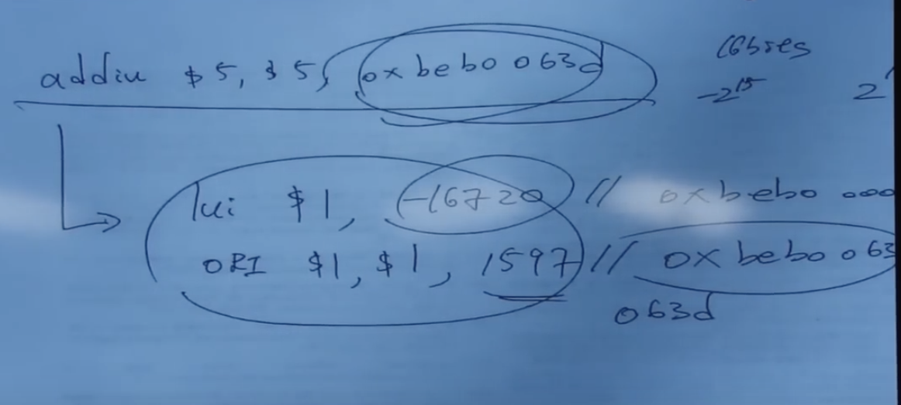

Instruction length:
- Fixed length:
    -  (+) easier to decode single instruction in hardware
    -  (+) easiser to decode multiple instrucitons concurrently
    -  (-) wasted bits in instructions, need to transfer more bits from memory to processor
    -  (-) harder to extend ISA (how to add new instructions?)
- Variable length:
    - length of instrucitons different

- Superscalar processor: fetches and executes multiple instructions at the same time
 
- you can have no dependency among the decoders for each instruction
- each decoder knows where exactly where the instruction is
- but if you have variable length instructions
- decoders must be much more complex

- you construct a tree based on frequency
- You only need necessary amount of bits to encode each instruction
- more logic to decoe each instruction

- When you transfer bits from memory you dont just transfer 32 bits, youre transferring a big chunk of data as well, in variable length instruction setting you can encode more instructions in those 128 bytes.

- Unifrom decode: same bits in each instruction correspond to the same meaning
    - so essentially bits at certain locations are always reserved for a specific purpose if its fixed length
    - Opcode is always in the same location
    - Ditto operand specifiers, immediate values
    - (+) makes it easier to decode, simpler hardware
    - (+) enables parallelism: generate target address before knowing the instruction is a branch
    - (-) restricts instructrion format or wastes space
    - in variable length, hard o think of uniform decode as a property of instructions of different length, it can be a property of instructions of the same length
    - uniform decode usually goes with fixed length
- Non-uniform decode:
    - unpredictable, opcode can be the 1st-7th byte in x86

MIPS instruction format:
- allows for very simple decoding
- 4 bytes per instruction , regardless of format
- format and fields easy to extract in hardware

RISC:
- simple instructions
- fixed length
- unifrom decide 
- few addressing modes

Number of registers:

- affects:
    - number of bits used for encoding register address
    - number of values kept in fast storage (register file)
    - (uarch) size,  access time, power consumption of register file
- large number of registers:
    - enables better register allocation (and optimizations) by compiler -> fewer saves/restores
    - larger instruction size
    - larger register file size

Addressing modes:
- Register indirect: m[r2], r2 = ptr

- Memory indirect: m[m[r2]], r2 stores a pointer then the pointer points to value
- Addressing mode specifies how to obtain an operand of an instruction 
    - register
    - immediate 
    - memory (displacement, register indirect, indexed, absolute, memory indirect, autoincrement, autodecrement)
- more modes:
    - it allosw you to implement more data structures
    - (+) help supprt programming constructs (arrays,pointer-based accesses)
    - make it harder for the architect to design
    - too many choices for the compiler
        - many ways to do the same thing complicates compiler design
    - with more addressing modes, youre closing semnatic gap get closer to high level language

- x86 vs alpha instruction formats

- Base + index (SIB byte)
    - good for arrays
    - find certain values to store in base registers
    - store the index in another register

- Usecases of different addressing modes:
    - Displacement:
        - direct offset to the operand
        - usually refers to static addresses
        - the displacement is encoded in the instruction
        - a direct offset to the operand
    - Base:
        - A base alone represents an indirect offset to the operand
        - the base register can change
        - used for dynamic storage of variables and data structure
    - Displacement and base:
        - as an index into an array
        - displacement compoennt encodes the static offset to the beginning of the array
        - the base holds the results of a calculation to determine the offset to a specifc element in the array
        - to access a field of a record: the base register holds the address of the beginning of the record, while the displacement is a static offset to the field.

Other ISA-level tradeoffs
- condition codes or not: for example if the result of the instructio n was a 0 it would set a E flag
- VLIW vs single instruction
- virtual memory
- etc

MIPs: aligned access
- LW/SW alignment restriction: 4-byte word alignment
    - not designed to fetch memory butes not within a word boundary 
    - when you put data into memory storage, you address should be multiples of your word size, MIPS is 4 bytes so all your addresses must be multiples of 4 bytes

    - How to check if address A N-byte aligned?
        - A % N = 0
        - in MIPS, N = 4

    - When that happens you want to provide seperate opcodes for the infrequent case
        - LWL rd 6 (r0) (load into left portion of registers)
        - LWR rd 3 (r0) (load into right portion of registers)

X86:
- unaligned access
- LD/ST instructions automaticaly align data that spans a word boundary
- programmer/compiler does not need to worry about where data is stored

MIPS ISA:
- Program counter
- Memory: 2^32 by 8 bit locations (4GB)
- 32 bit address

MIPS Data format:
- 32 bits, instruction and data addresses
- signed and unsigned integers
- just bits

- 16 bit word and 8 bit word (aka byte)
- floating point numbers
    - IEEE standardf 754
    - float: 8 bit exponent, 23 bit significand
    - double: 11 bit exponent, 52 bit significand

Big Endian vs Little Endian
- 32 bit signed or unsigned integer comprises 4 bytes
- on a byte addressable machine

ALU instructions
- Assembly : ADD r_dest, r_sreg, r_treg

- Machine encoding (R type): |0|rs|rt|rd|0|ADD
- Semantics:  GPR[rd] <- GPR[rs] + GPR[rt]; PC <- PC + 4
- Variations:
    - arithmetic: {signed,unsigned} x {ADD}
    - logical: {AND,OR,XOR,NOR}
    - shift: {L,R-logical,R-arithmetic}

ALU instructions:
- Assembly: LW r_treg, offset_16 (base_reg)
- Machine encoding: |LW|base|rt|offset|
- Semantics: 
    - effective_address = sign-extend(offset) + GPR[base]
    - GPR[rt] = MEM[translate(effective_address)]
    - PC <- PC + 4
- Exceptions:
    - address must be word aligned

ALU instructions:
- Assembly (e.g. store 4-byte word)
- SW r_treg, offset_16(base_reg)
- Machine encoding: |SW|base|rt|offset|
- Semantics:
    - effective_address = sign-extend(offset) + GPR[base]
    - MEM[translate(effective_address)] <- GPR[rt]
    - PC <- PC + 4
- Exceptions:
    - address must be word aligned

Control-flow instructions

Conditional Banch Instructions
- Assembly (branch is equal): BEQ r_sreg, r_treg, immediate
- Machine encoding: |BEQ|rs|rt|immediate| I-type
- Semantics:
    - target = PC (its actually PC+4) + sign extended(immediate) x 4
    - if GPR[rs] == GPR[rt]:
    - then PC <- target else PC <- PC + 4
- How far can you jump?
    - immediate can be 16 bits
    - multiply by 4 -> 18 bits
    - 18 bits in 2s compliment => - 2^17, 2^17 -1
    - thats around 128 kilobytes is your range

Function calls and returns
- Jump and Link: JAL offset_26
    - return address = PC + 8
    - target = $PC[31:28]*2^28 |_{\text{bitwise or} \text{zero-extend}}(\text{immediate}) x 4$
    - PC <- target 
    - GPR[r31] <- return address

Mmeory usage convention

Register Usage convention

Caller and callee saved registers:
- Callee-saved registers (ashley will help me tidy up after she is done)
    - caller says to callee, "The values of these registers should not change when you return to me"
    - calle says "if i need to use these registers, i promise to save the old values to memory first before returning"
- Caller saved registers: (i tidy up myself)
    - dont count on these registers having same values after function call

Calling convention

